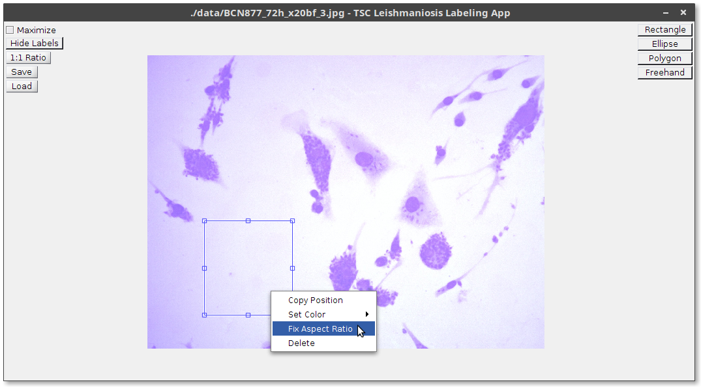
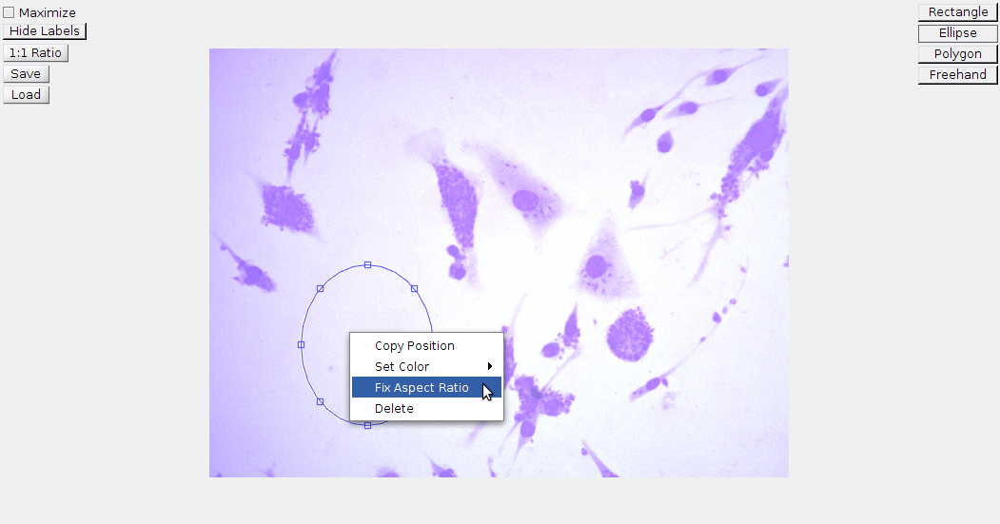
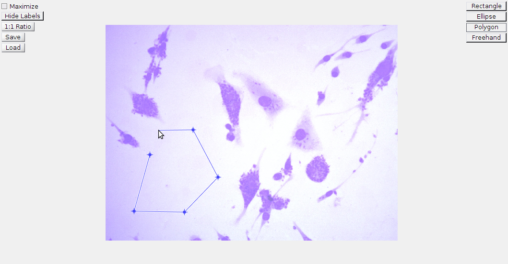
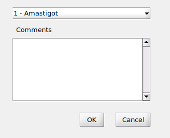
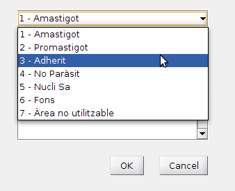
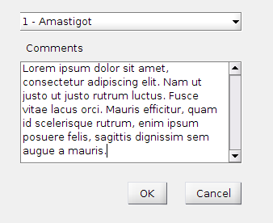
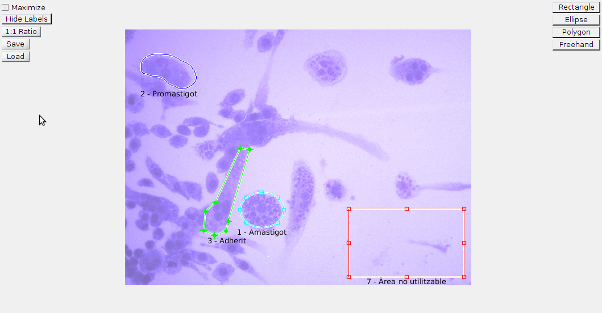

# TSC Labeling App User documentation

This program is made for labeling regions of an image. The image can be of any
type, as long as it is formatted in any of the formats
listed [below](#file-types).

The regions can take any of these four regions: **[Rectangle](#rectangle)**,
**[Ellipse](#ellipse)**, **[Polygon](#polygon)** or **[Freehand](#freehand)**.
They are explained in detail in [Available region types](#available-region-types).

Each region can belong to one of the many available labels (which will be
configurable by the user in a future version), and contain a comment. All of
this is detailedly explained in [Label selection](#label-selection)

<!-- This app has been developed for the project **NOM_PROJECTE** from the Image
Processing Group ([GPI]) at the Signal Theory and Communications
Department ([TSC]) of Universitat Politècnica de Catalunya - BarcelonaTech
([UPC]). It has been funded by the UPC's Centre for Development
Cooperation ([CCD]), as a part of its [UPC project on neglected diseases][neglected-diseases]. -->

<!-- START doctoc generated TOC please keep comment here to allow auto update -->
<!-- DON'T EDIT THIS SECTION, INSTEAD RE-RUN doctoc TO UPDATE -->
**Contents**

- [Installation](#installation)
- [Running the app](#running-the-app)
    - [Main menu](#main-menu)
    - [Region selection](#region-selection)
        - [Available region types](#available-region-types)
            - [Rectangle](#rectangle)
            - [Ellipse](#ellipse)
            - [Polygon](#polygon)
            - [Freehand](#freehand)
        - [Config buttons](#config-buttons)
            - [Maximize/Restore](#maximizerestore)
            - [Hide/Show labels](#hideshow-labels)
            - [1:1 Ratio](#11-ratio)
            - [Save](#save)
            - [Load](#load)
    - [Label selection](#label-selection)
- [Contact](#contact)

<!-- END doctoc generated TOC please keep comment here to allow auto update -->

## Installation

To install the app, follow these instructions:

1. Download the code from the repository ([click here][src_down])
2. Unzip the app's code from the .zip file
3. Install the JSONlab library
  - Inside MATLAB, double-click the `lib/jsonlab-1.5.mltbx` file and click ***Install***
4. Call `main_menu.m` on MATLAB's command line.

The source code of this app can be downloaded from [this repository][projrepo].

## Running the app

### Main menu

The app's main menu looks like this:

The **Browse** button lets the user choose an image file. The supported
extensions and formats are:

- JPG, JPEG - Joint Photographic Experts Group
- PNG - Portable Network Graphics
- BMP - Windows Bitmap
- CUR - Windows Cursor resources
- GIF - Graphics Interchange Format
- HDF - Hierarchical Data Format
- ICO - Windows Icon resources
- PBM - Portable Bitmap
- PCX - Windows Paintbrush
- PGM - Portable Graymap
- PNM - Portable Any Map
- PPM - Portable Pixmap
- RAS - Sun Raster
- XWD - X Window Dump
- JP2 - JPEG 2000 (Part 1)
- JPF, JPX - JPEG 2000 (Part 2)
- J2C, J2K - JPEG 2000 (raw codestream)
- TIF, TIFF - Tagged Image File Format
- FTS, FITS - Flexible Image Transport System

The image file to be labeled can also be selected by writing its path in the
text box.

When the **Open image** button is clicked, the main menu is closed and the
region selection window opens.

### Region selection

The buttons at the right of the window are used to choose the kind of region to
be selected. The buttons at the left control some configuration aspects of the
app.

The app displays a text below each region, showing the selected label.

#### Available region types

At the time of writing, the labeling app supports four region types:
**Rectangles**, **Ellipses**, **Polygons** and **Freehand** regions.

Each region is confirmed once it is closed and double-clicked. Once it is
confirmed, the [Label Selection window](#label-selection)

##### Rectangle

Freehand regions cannot be modified once they are closed.

Rectangular regions are selected by dragging the mouse pointer. They can be
resized by dragging any of its sides or corners.

Its aspect ratio can be locked by right-clicking the rectangle and selecting the
**Fix aspect ratio** option, or by pressing the `Shift` key at the moment of
resizing. When the aspect ratio is locked, a rectangle can only be resized by
dragging its corners.

##### Ellipse

Elliptical regions are selected by dragging the mouse pointer. They can be
resized by dragging any of its sides or corners.

Its aspect ratio can be locked by right-clicking the ellipse and selecting the
**Fix aspect ratio** option, or by pressing the `Shift` key at the moment of
resizing. When the aspect ratio is locked, an ellipse can only be resized by
dragging its corners.

##### Polygon

Polygonal regions are selected by repeatedly clicking on the image. Each click
inserts a new vertex to the polygon at the location of the mouse pointer.

Regions are closed by either right-clicking the image (this directly closes the
polygon) or by double-clicking the image (this adds a last vertex and closes the
polygon).

Polygons can have additional points added. To do so, the 'a' key must be pressed
and then click on the desired point.

Polygon points can be moved around, by placing the mouse pointer on top the
desired point. The pointer will turn into a circle. Then, the point can be
dragged around.

##### Freehand

Freehand regions are selected by clicking and dragging the mouse pointer along
the image until the left button of the mouse is released. The region is then set
as the path traveled by the pointer.

Freehand regions cannot be modified once they are closed.

#### Config buttons

##### Maximize/Restore

At the top left corner of the window there is a check box, labeled 'Maximize'.
This check box allows the user to maximize the app's window. The box restores
the window to its original size if it is clicked when the app is maximized.

##### Hide/Show labels

Below the 'Maximize' check box, there is a toggle button labeled 'Hide Labels'.
This toggle button hides/shows the labels shown below each region.

##### 1:1 Ratio

This button only works with rectangular and elliptical regions. This button sets
the region's aspect ratio as 1:1 i.e. square or circle.

##### Save

This button saves the currently selected regions and their labels to a JSON file.

The JSON file is named like the image on which the labels were selected.

##### Load

This button loads previously saved labels from a JSON file named like the image
on which the labels are to be loaded.

### Label selection

This window appears when a region is confirmed. It allows the user to choose a
label for a region and, if she so chooses, to write a comment for it. The pop-up
menu at the top of the window allows the user to choose the label for the
region. The 'Comments' box allows for up to 20 lines of text to be written.

  

**At the time of writing, the available labels cannot be adjusted by the user. In
a future version, the user will be able to select them.**

After the user clicks 'OK', the region is assigned the label and is displayed in
a colour, with the label shown below it, like is shown in the image below:

## Contact

Bugs, missing features, improvements, etc. can be reported by submitting an
Issue at the
[project's repository][issues].

---

This webpage is hosted with [GitLab Pages]. This page has been built
with [Harp][harp].

<a href="#" class="back-to-top">Back to Top</a>

<!-- Code from http://html-tuts.com/back-to-top-button-jquery/ -->

[src_down]: https://gitlab.com/albertaparicio/tsc-leishmaniosis/repository/archive.zip?ref=master
[GPI]: https://imatge.upc.edu/web/
[TSC]: http://www.tsc.upc.edu/en
[UPC]: http://www.upc.edu/?set_language=en
[CCD]: https://www.upc.edu/ccd/en
[neglected-diseases]: http://www.upc.edu/ccd/ca/accions-al-sud/projectes-2016/coordinacio-del-treball-de-la-upc-contra-les-malalties-desateses
[GitLab Pages]: https://pages.gitlab.io/
[harp]: http://harpjs.com/
[projrepo]: https://gitlab.com/albertaparicio/tsc-leishmaniosis/
[issues]: https://gitlab.com/albertaparicio/tsc-leishmaniosis/issues
