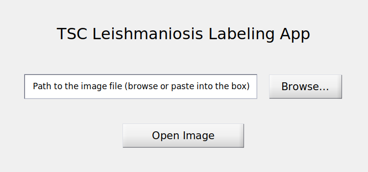

# TSC Image Labeling App: User documentation

---

<!-- START doctoc generated TOC please keep comment here to allow auto update -->
<!-- DON'T EDIT THIS SECTION, INSTEAD RE-RUN doctoc TO UPDATE -->
**Table of Contents**  *generated with [DocToc](https://github.com/thlorenz/doctoc)*

    - [Running the app](#running-the-app)
- [Main menu](#main-menu)
- [GitLab User or Group Pages](#gitlab-user-or-group-pages)
- [Did you fork this project?](#did-you-fork-this-project)
- [Troubleshooting](#troubleshooting)

<!-- END doctoc generated TOC please keep comment here to allow auto update -->

### Running the app

The app is run my calling `main_menu` on MATLAB's command line.

## Main menu

The app's main menu looks like this:

## GitLab User or Group Pages

To use this project as your user/group website, you will need one additional
step: just rename your project to `namespace.gitlab.io`, where `namespace` is
your `username` or `groupname`. This can be done by navigating to your
project's **Settings**.

Read more about [user/group Pages][userpages] and [project Pages][projpages].

## Did you fork this project?

If you forked this project for your own use, please go to your project's
**Settings** and remove the forking relationship, which won't be necessary
unless you want to contribute back to the upstream project.

## Troubleshooting

1. CSS is missing! That means two things:

    Either that you have wrongly set up the CSS URL in your templates, or
    your static generator has a configuration option that needs to be explicitly
    set in order to serve static assets under a relative URL.

----

Forked from @VeraKolotyuk

[ci]: https://about.gitlab.com/gitlab-ci/
[harp]: http://harpjs.com/
[install]: http://harpjs.com/docs/quick-start
[documentation]: http://harpjs.com/docs/
[userpages]: http://doc.gitlab.com/ee/pages/README.html#user-or-group-pages
[projpages]: http://doc.gitlab.com/ee/pages/README.html#project-pages
