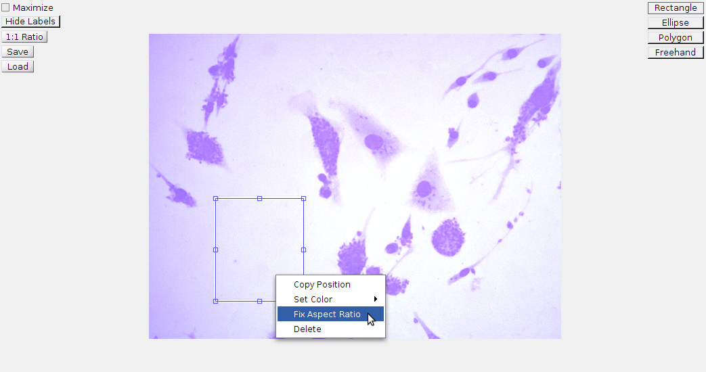

# TSC Leishmaniosis Labeling App User documentation

<!-- START doctoc generated TOC please keep comment here to allow auto update -->
<!-- DON'T EDIT THIS SECTION, INSTEAD RE-RUN doctoc TO UPDATE -->
**Table of Contents**  *generated with [DocToc](https://github.com/thlorenz/doctoc)*

- [Running the app](#running-the-app)
- [Main menu](#main-menu)
- [Region selection](#region-selection)
    - [Available region types](#available-region-types)
        - [Rectangle](#rectangle)
        - [Ellipse](#ellipse)
        - [Polygon](#polygon)
            - [Foo](#foo)
        - [Freehand](#freehand)
    - [Config buttons](#config-buttons)
- [Template stuff](#template-stuff)
- [Did you fork this project?](#did-you-fork-this-project)
- [Troubleshooting](#troubleshooting)

<!-- END doctoc generated TOC please keep comment here to allow auto update -->

## Running the app

The app is run my calling `main_menu` on MATLAB's command line.

## Main menu

The app's main menu looks like this:

The **Browse** button lets the user choose an image file. The supported
extensions and formats are:

- JPG, JPEG - Joint Photographic Experts Group
- PNG - Portable Network Graphics
- BMP - Windows Bitmap
- CUR - Windows Cursor resources
- GIF - Graphics Interchange Format
- HDF - Hierarchical Data Format
- ICO - Windows Icon resources
- PBM - Portable Bitmap
- PCX - Windows Paintbrush
- PGM - Portable Graymap
- PNM - Portable Any Map
- PPM - Portable Pixmap
- RAS - Sun Raster
- XWD - X Window Dump
- JP2 - JPEG 2000 (Part 1)
- JPF, JPX - JPEG 2000 (Part 2)
- J2C, J2K - JPEG 2000 (raw codestream)
- TIF, TIFF - Tagged Image File Format
- FTS, FITS - Flexible Image Transport System

The image file to be labeled can also be selected by writing its path in the
text box.

When the **Open image** button is clicked, the main menu is closed and the
region selection window opens.

## Region selection

The buttons at the right of the window are used to choose the kind of region to
be selected. The buttons at the left control some configuration aspects of the
app.

### Available region types

At the time of writing, the labeling app supports four region types:
**Rectangles**, **Ellipses**, **Polygons** and **Freehand** regions.

#### Rectangle

Rectangular regions are selected by dragging the mouse pointer.

Its aspect ratio can be locked by right-clicking the rectangle and selecting the
**Fix aspect ratio** option:

#### Ellipse

Elliptical regions are selected by dragging the mouse pointer.

#### Polygon

Polygonal regions are selected by repeatedly clicking on the image. Each click
inserts a new vertex to the polygon at the location of the mouse pointer.

Regions are closed by either right-clicking the image (this directly closes the
polygon) or by double-clicking the image (this adds a last vertex and closes the
polygon).

#### Freehand

Freehand regions are selected by clicking and dragging the mouse pointer along
the image until the left button of the mouse is released. The region is then set
as the path traveled by the pointer.

### Config buttons

<!--## Template stuff

To use this project as your user/group website, you will need one additional
step: just rename your project to `namespace.gitlab.io`, where `namespace` is
your `username` or `groupname`. This can be done by navigating to your
project's **Settings**.

Read more about [user/group Pages][userpages] and [project Pages][projpages].

## Did you fork this project?

If you forked this project for your own use, please go to your project's
**Settings** and remove the forking relationship, which won't be necessary
unless you want to contribute back to the upstream project.

## Troubleshooting

1. CSS is missing! That means two things:

    Either that you have wrongly set up the CSS URL in your templates, or
    your static generator has a configuration option that needs to be explicitly
    set in order to serve static assets under a relative URL.

----

Forked from @VeraKolotyuk

[ci]: https://about.gitlab.com/gitlab-ci/
[harp]: http://harpjs.com/
[install]: http://harpjs.com/docs/quick-start
[documentation]: http://harpjs.com/docs/
[userpages]: http://doc.gitlab.com/ee/pages/README.html#user-or-group-pages
[projpages]: http://doc.gitlab.com/ee/pages/README.html#project-pages
-->
